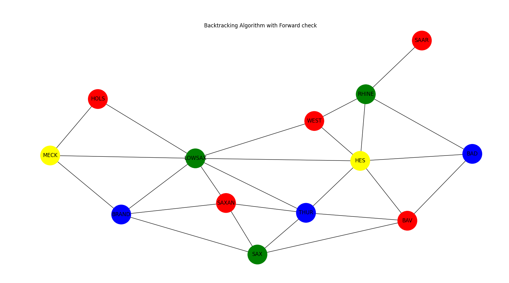

# IA Lab 4

Authors: Barat Narcis Stefan & Gradinariu Florin Marian

## Problema colorării unei hărți
Considerăm o hartă cu n țări. Fiecare regiune/țară poate fi colorată cu o culoare dintr-o mulțime de culori asociate. Să se coloreze harta a.î. regiunile/țările vecine să fie colorate diferit.

Modelare: asignăm fiecărei regiuni/țări de pe hartă o variabilă; domeniul fiecărei variabile este o mulțime de culori specificată. Restricțiile sunt de forma: Xi ≠ Xj (două țări vecine au culori diferite). Obs: între două țări vecine în graful constrâns vom adăuga o muchie.

## Statement

Implementați algoritmul Forward-checking + MRV pentru problema de colorare a unei hărți, modelată ca problemă de satisfacere a constrângerilor.

## Steps

- &#9745; 1. (0.3) Modelarea problemei ca o problemă de satisfacere a  constrângerilor.
- &#9745; 2. (0.5) Implementarea metodei FC.
- &#9745; 3. (0.2) Implementarea MRV.

The checkbox means that the problem was solved.

### Output

#### FC

```bash
Strategies:
	(1) BKT for Forward checking
	(2) BKT for Minimum remaining values
	(3) BKT for Forward checking + Minimum remaining values
Select the search strategy you would like to use: 1
Solution with Backtracking Algorithm with Forward check  took 0.6396491527557373 sec and 109072 checks
{'BAV': 'red', 'BAD': 'blue', 'SAAR': 'red', 'RHINE': 'green', 'WEST': 'red', 'HES': 'yellow', 'THUR': 'blue', 'SAX': 'green', 'SAXAN': 'red', 'LOWSAX': 'green', 'HOLS': 'red', 'BRAND': 'blue', 'MECK': 'yellow'}
```

