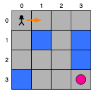
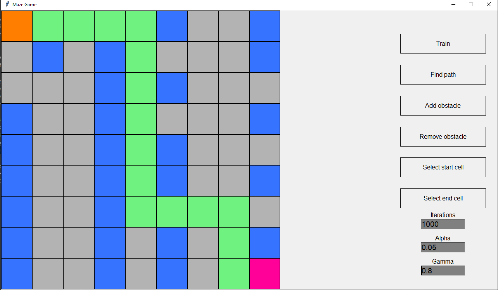

# IA Lab 9-10

Authors: Barat Narcis Stefan & Gradinariu Florin Marian

# Q-learning

## Statement

Considerăm un agent care se poate deplasa într-un mediu (un grid de dimensiuni nxn). Agentul se poate
deplasa în direcția sus, jos, stânga sau dreapta. Agentul poate merge pe gheață. În unele locuri, gheața
este subțire și se poate sparge. Dacă agentul ajunge într-o astfel de locație, atunci acesta moare.

Spre exemplu, putem avea următoarea configurație (4x4, iar pătratele albastre reprezintă gheața care se
poate sparge):



Având un punct de start, scopul agetului este să ajungă la destinație. În exemplul de mai sus, punctul de
start este pătratul stânga-sus, iar destinația este pătratul dreapta-jos. Când agentul ajunge la destinație,
recompensa este egală cu 1, altfel este 0.

## Steps

I. (1.0) Implementarea algoritmului Q-learning

- &#9745; a. (0.1) Inițializarea tabelei Q, a parametrilor algoritmului și a stării inițiale.
- &#9745; b. (0.1) Pentru o stare s, identifică starea următoare s’ prin aplicarea unei acțiuni a.
- &#9745; c. (0.8) Implementați algoritmul Q-learning pentru a identifica drumul pe care trebuie să-l parcurgă agentul
    - selectează acțiunea cu cea mai mare valoare Q din starea s’
    - actualizează valorile Q
    - actualizează starea curentă
    - repetă
    
II. (0.6) Utilizarea unei rețele neuronale pentru a aproxima funcția Q / Implementarea algoritmului Deep
Q-learning

The checkbox means that the problem was solved.

## Observations

- se poate folosi mediul Open AI gym https://gym.openai.com/

# Output
```commandline
Training started!
Training ended!
Path length: 15
```
